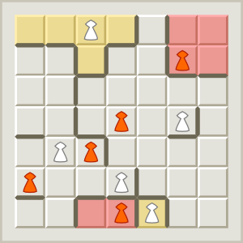
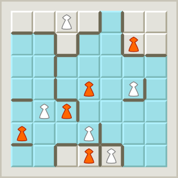
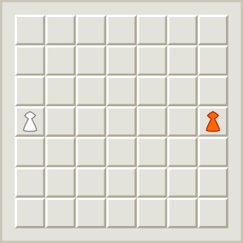
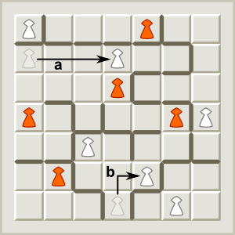
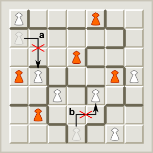
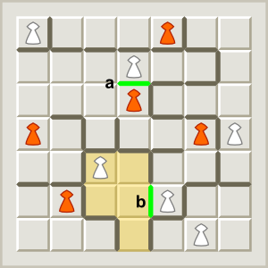
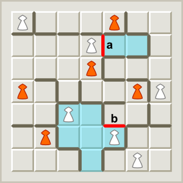
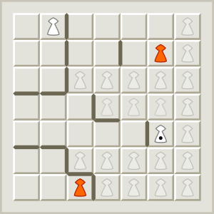
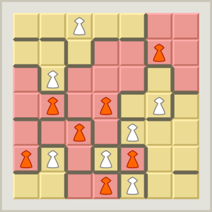

# Fendo

## Material

- Game board with 7 × 7 spaces
- 7 white and 7 orange pieces
- a sufficient number of sticks (about 50 “fences”)

## Terminology
### “Closed area”

A “closed area” is an enclosed area of spaces with exactly one piece inside representing the owner. There are no empty closed areas.

  
_Four closed areas_

### “Open area”

The “open area” is the area of spaces with more than one piece inside. There is always only one open area. At the beginning of the game the entire game board represents the open area, at the end the open area is cleared away as only closed areas exist.

  
_The open area_

## Objective

Players try to enclose the largest total area on the board.

## Preparation

Players choose their color and take the corresponding 7 pieces. At the beginning players place one of their pieces on the center space on their side.

  
_Setup_

Both players can use the fences.

## Play

Players take turns. White begins.

In each turn there are two possible actions, one of which a player must choose:

- Select a piece and build a fence
- Add a piece

A player who has no action available must pass their turn.

### a) Select a piece …

A player selects one of their own pieces in the open area. This piece may now be moved.

Pieces move in a straight horizontal or vertical line (not diagonally) arbitrarily far, not on or over other pieces and not across sticks. During the movement the piece may change the direction once at a right angle.

  
_Correct moves: (a) on a straight line as far as desired, (b) one turn is allowed._

  
_Incorrect moves: (a) over a fence, (b) turning more than once._

### … and build a fence

After an optional movement a fence must be built on one of the empty sides of the piece’s space. The outer edges of the board already represent a solid boundary, in the inside borders are formed with the fences.

When building a fence the following must always be considered: If an area is enclosed, there must be exactly one piece (of any color) inside. Creating an empty area is disallowed as well as enclosing another open area (with multiple pieces inside).

Note that a selection and/or move is not possible, if no fence can be built legally at the target space.

  
_Correct placement of fences: (a) within the open area, no enclosing, (b) enclosing an area._

  
_Incorrect placement of fences: (a) enclosing an empty area, (b) enclosing another open area._

### b) Add a piece

A player places a piece from their stock on an empty space which is exactly one move away from a friendly piece in the open area.

No fence is built in this action.

  
_White may place a new piece on any of the marked spaces as they are exactly one move away from a friendly piece in the open area._

## End of the game

The game ends as soon as the open area is cleared away by placement of a fence, i.e., only closed regions with single pieces inside exist. Players may still have pieces in their stocks.

Finally, players add the number of spaces of all areas they own.

The player with the highest total score wins.

  
_White wins with 25-24._

## Credits

This rule book was adopted from Dieter Stein's website:  
https://spielstein.com/games/fendo/rules